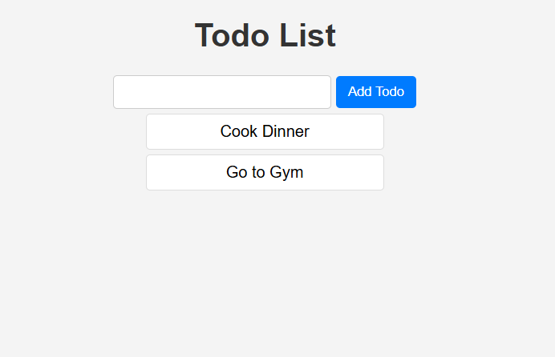

# Todo List 📝

A simple Todo List application built using **HTML, CSS, and JavaScript**. This app allows users to add, display, and delete tasks. It also stores todos in **local storage**, so they remain even after refreshing the page.

## 🚀 Features
- ✅ Add new todos
- ✅ Display saved todos
- ✅ Delete todos by clicking on them
- ✅ Stores todos in **Local Storage**
- ✅ Simple and clean UI

## 🛠️ Technologies Used
- **HTML** – Structure of the app  
- **CSS** – Styling for a clean UI  
- **JavaScript** – Functionality and Local Storage  

## 📌 How to Use
1. Clone or download the repository:
   ```sh
   git clone https://github.com/your-username/todo-list.git
   cd todo-list
2. Open index.html in a browser.
3. Type a todo in the input field and click Add Todo.
4. Click on a todo item to delete it.

## 📷 Screenshot
